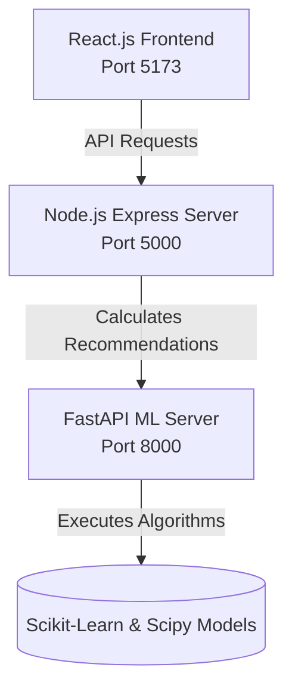

# NexAnime: AI-Powered Anime Recommender

NexAnime (formerly AnimeRex) is an anime discovery and recommendation platform migrated to a modern full-stack web application. It integrates a React.js client, a Node.js Express backend API, and a Python FastAPI Machine Learning recommendation engine to deliver fast, responsive, and highly personalized suggestions.

---

## 🏗️ Architecture

The project has been restructured into three specialized services:



1. **`client/`**: A high-fidelity, modern React.js frontend built with Vite and pure CSS. It features a responsive layout, a gorgeous cyberpunk-inspired dark theme, custom scrolls, skeleton loaders, and interactive sliders.
2. **`server/`**: A Node.js Express server that loads and parses the `Animeslist.csv` dataset into memory on startup for sub-millisecond querying, searching, filtering, and detailed metadata lookups.
3. **`ml-server/`**: A Python FastAPI backend dedicated to executing recommendation algorithms. It holds model files (`.pkl` and `.npz`) in memory to eliminate filesystem read delays and computes results instantly.

---

## 🚀 Getting Started

To run the complete system locally, follow the steps below to start each service:

### 1. Machine Learning Server (`ml-server`)
The ML server runs on **Python 3.9+** and listens on port `8000`.

1. Navigate to the `ml-server` folder:
   ```bash
   cd ml-server
   ```
2. Create and activate a Python virtual environment:
   ```bash
   python -m venv env
   # Windows:
   env\Scripts\activate
   # macOS/Linux:
   source env/bin/activate
   ```
3. Install the dependencies:
   ```bash
   pip install -r requirements.txt
   ```
4. Start the server using Uvicorn:
   ```bash
   uvicorn main:app --host 0.0.0.0 --port 8000 --reload
   ```

---

### 2. Node.js Backend Server (`server`)
The API gateway loads data and coordinates with the ML server on port `5000`.

1. Open a new terminal and navigate to the `server` folder:
   ```bash
   cd server
   ```
2. Install npm packages:
   ```bash
   npm install
   ```
3. Run the development server (runs with nodemon):
   ```bash
   npm run dev
   ```

---

### 3. React Frontend (`client`)
The user interface connects to the Express backend on port `5173`.

1. Open a new terminal and navigate to the `client` folder:
   ```bash
   cd client
   ```
2. Install dependencies:
   ```bash
   npm install
   ```
3. Start the Vite development server:
   ```bash
   npm run dev
   ```
4. Open your browser and navigate to `http://localhost:5173`.

---

## 🧠 Recommendation Algorithms

NexAnime uses a hybrid recommendation strategy:
* **Popularity-based Filtering (Home Page):** Leverages a customized IMDb weighted rating formula adjusted for rank, favorites, member count, and time decay to float trending, classic, or popular anime.
* **Hybrid Filtering (Search & Details Modal):** Combines:
  * **Content-Based Filtering:** Vectorizes anime synopsis and genres using TF-IDF and uses Nearest Neighbors to locate titles with similar metadata.
  * **Collaborative Filtering:** Uses item-based sparse matrix representations of user ratings to find associations.
